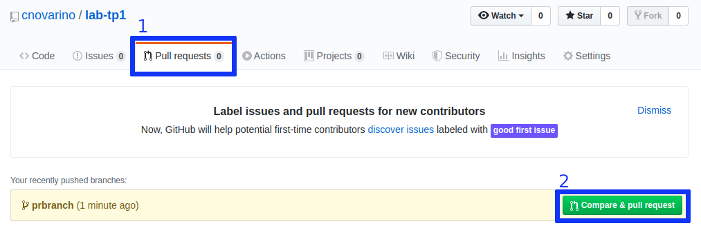
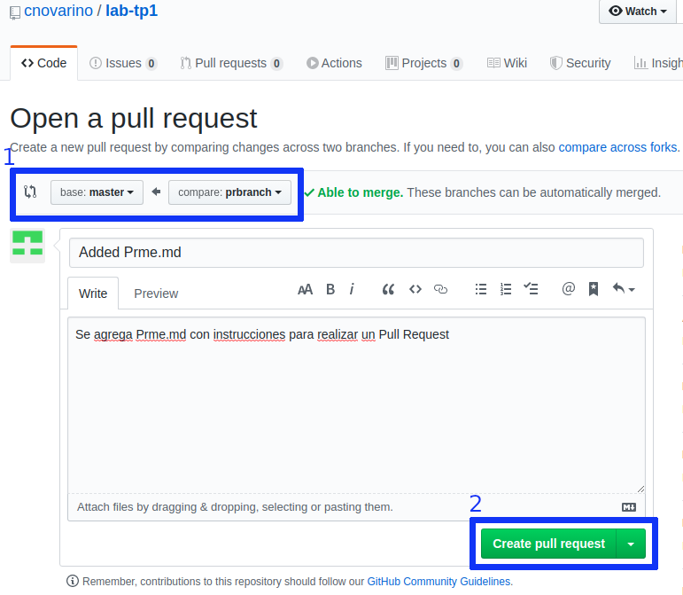
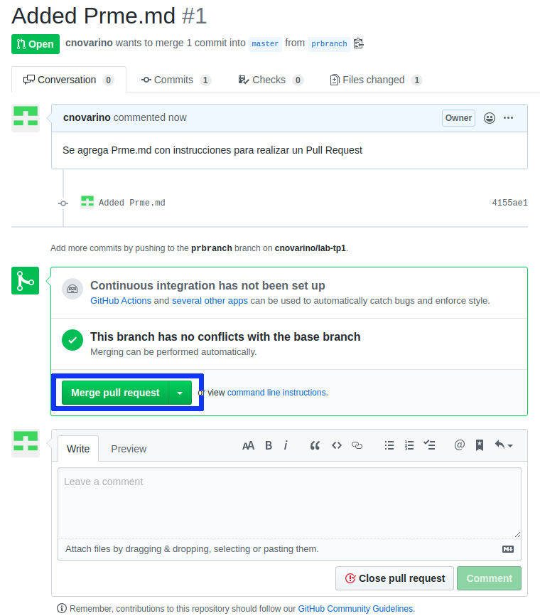

# Pull Request

Una Pull Request es la acción de validar un código que se va a mergear de una rama (tambien puede ser de un fork) a otra

> Un fork significa bifurcación, y en programación supone copiar un proyecto para hacerle modificaciones.

### Ejemplo

1. Creamos una nueva branch y le hacemos checkout

```
git branch prbranch
git checkout prbranch
```

2. Realizamos las modificaciones necesarias, las agregamos y hacemos un commit

```
echo > prme.md
git add prme.md
git commit -m "Added Prme.md"
```

3. Pusheamos la nueva branch con los cambios al repositorio remoto
```
git push origin prbranch
```

4. Desde Github.com comparamos las branch con la que queremos mergear y creamos un Pull Request



5. Seleccionamos desde donde y hacia cual Branch se va a realizar el Pull Request


6. Por ultimo solucionamos los conflictos existentes y luego mergeamos.

