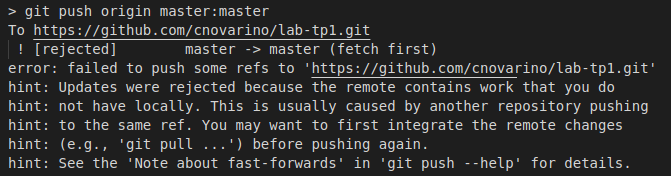
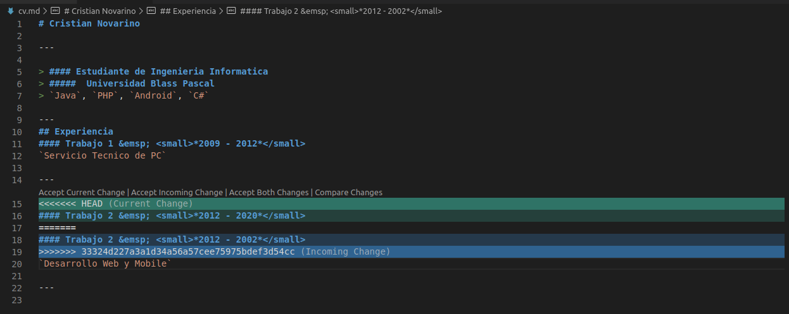

# Merge

### Error en Push

### Conflictos en el Merge

### Version Local
Es la version local del archivo sobre la branch en la que estas parado.

### Version Remote
Es la version remota del archivo el cual se esta tratando de mergear con el archivo local.

### Version Base
Es el ultimo commit que tienen en comun entre las versiones local y remota. Sirve para poder tomar la decision a la hora de mergear.
